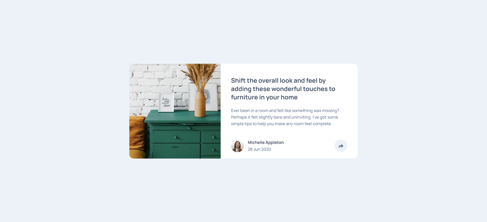

# Frontend Mentor - Article preview component solution

This is a solution to the [Article preview component challenge on Frontend Mentor](https://www.frontendmentor.io/challenges/article-preview-component-dYBN_pYFT). Frontend Mentor challenges help you improve your coding skills by building realistic projects.

## Table of contents

- [Overview](#overview)
  - [The challenge](#the-challenge)
  - [Screenshot](#screenshot)
  - [Links](#links)
- [My process](#my-process)
  - [Built with](#built-with)
  - [What I learned](#what-i-learned)
- [Author](#author)

## Overview

My challenge is to build out this article preview component and get it looking as close to the design as possible.

### The challenge

Users should be able to:

- View the optimal layout for the component depending on their device's screen size
- See the social media share links when they click the share icon

### Screenshot



### Links

- Solution URL: [Add solution URL here](https://your-solution-url.com)
- Live Site URL: [Add live site URL here](https://your-live-site-url.com)

## My process

### Built with

- Semantic HTML5 markup
- CSS custom properties
- Flexbox
- Mobile-first workflow

### What I learned

Using the vertical-align property to vertically align images or other inline elements like span alements to get them to line up as desired.

I found its best to build out the basic design first and get it looking correct on all screen sizes and then add the more complex stuff later, like creating and absolute positioning the pop up elements. Leave stuff like that until last.

```css
img {
  vertical-align: bottom;
}
```

## Author

- Name - Paul Ryan
- Frontend Mentor - https://www.frontendmentor.io/profile/Gunner40
